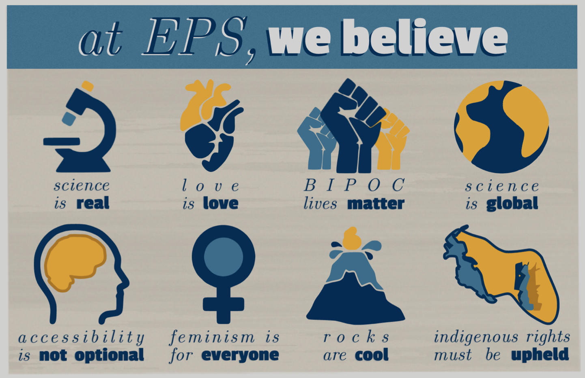



Graduate Student Fellowships 
======
* [NSF GRFP](https://www.nsfgrfp.org)
* [Hertz Fellowship](https://www.hertzfoundation.org)
* [Ford Foundation Graduate Fellowship](https://www.fordfoundation.org)
* [SOROS Fellowship](https://www.pdsoros.org) \
$~$
$~$
$~$
$~$

Diversity, Equity and Inclusion
======
* [UC Berkeley's DEI Deparment](https://diversity.berkeley.edu)
* [URGE Website](https://urgeoscience.org/recordings/) \
\
\
**My statement.** I believe in diversity and justice for all BIPOC individuals of every identity. Diversity and justice are critical in scientific discoveries both on and off our planet. My journey will consist of growth, change, and regular self reflection. I acknowledge that this statement is only the first step towards the larger picture of building a diverse and equitable scientific community. I hope to show my statements meaning through my actions. I encourage others in my community to join me in the pursuit of meaningful reform.

   

